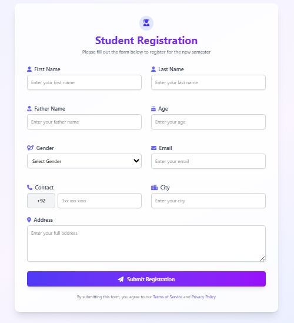

# 🧑‍🎓 Student Registration Form

A sleek, responsive student registration form built with **HTML**, **Tailwind CSS**, and **JavaScript**. This form allows users to register with essential details and displays the data in a dynamic table format.


---

## 🚀 Features

- Responsive design using **Tailwind CSS**
- Validates input (age limit, contact format)
- Predefined phone prefix (`+92`) for Pakistani users
- Gender dropdown defaults to "Select Gender"
- Displays user data in a formatted table
- "Clear All" button to reset user list
- Smooth transitions and modern UI

---

## 🧪 Technologies Used

- HTML5
- Tailwind CSS
- JavaScript (Vanilla)

---

## 🛠️ Setup Instructions

1. Clone the repository:
   ```bash
   git clone https://github.com/DoctorJunaid/Student_form.git
   ```

2. Open the `index.html` file in your browser:
   ```bash
   cd Student_form
   open index.html  # or drag and drop the file into your browser
   ```

---


## 🤝 Contributing

Pull requests are welcome! If you have suggestions or improvements, feel free to fork the repo and open a PR.

---

## 📄 License

This project is open source under the MIT License.

---

## 📫 Contact

Reach out via GitHub: [@DoctorJunaid](https://github.com/DoctorJunaid)
